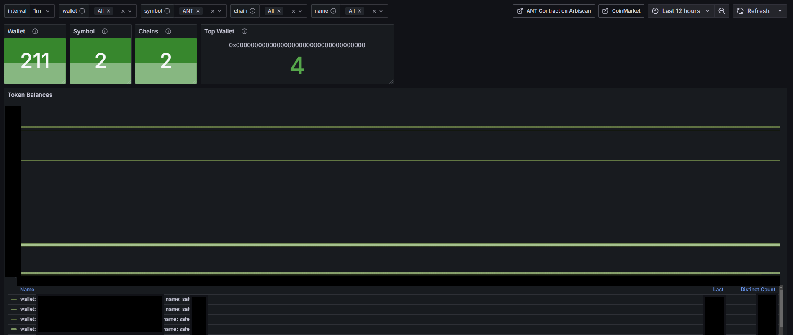

## Ant Exporter

**This is an Unofficial Utility, not supported by Autonomi / Maidsafe : please follow discussions on the [Forum](https://forum.autonomi.community/t/ant-exporter-arbitrum-one-and-other-erc-20-block-exporter/41277)**

A self hosted Docker, Prometheus, Grafana and Block-Chain scrapper, to allow visulisation and monitoring for your ERC-20 Wallets.

Docker is the engine, which allows the code to be run on lots of different Linux machines and Architetures, while it's not tested, it might even work on WSL2 (Windows Subsystem for Linux) on Microsoft.

Prometheus is a very efficient data store - Grafana is a nice user interface, to visulise the data in Dashboards.

The core application is written in Python, and hosted in this Repo - The instructions below give a quick start on how to download the latest version, and build it all on your machine.

The main control is provided by a configuration file config.yml, a demo one is included, but you will need to edit this to meet your requirements.

The config.yml file defines the RPC enpoints for the blockchains, that the application will query - please be mindfull that these are PUBLIC endpoints, so be careful on how many Wallet addresses you add.  The application is limited to batch the queries every 30 minutes, to avoid rate limiting.  If you wish to query more wallets, then you should look at hosting your own RPC endpoint for the chain (beyond the scope of how to set this up)

## Dashboard

There is a very basic Dashboard, to get you started - Any changes you make to this dashboard "MIGHT" be lost, so if you want to edit it, please create a copy of the Dashboard with a different name - If you make something you would like to share, send in a pull request with the updated Dashboard.



## Installation

This has been tested on Debian 12 fresh install, YMMV on different distro's.

* It's assumed you are the `root` user on the machine to install this application - It is also completely possible to `update` docker to allow this all to be done as a `normal` user, by adding the account to the docker group - please read up on the implications of this.

* I love `sudo` and everything I do has `sudo` infront of it - sorry that isn't supported... If you need to elevate your normal user account to `root` - please do `sudo su -` to bump your permissions.

1) Update the Linux distro applying packge updated : `apt update && apt upgrade -y`

2) Install docker, and git to allow the code to be used : `apt install docker-compose git`

3) Clone this repo, this will place it in where you run the command :
   ```
   git clone https://github.com/jadkins-me/ant_exporter

   cd ant_exporter

   git pull

   git checkout main
   ```

4) Create the config from the example file : `cp config.yml.dev config.yml`

### Edit config.yml file

Important : Please see the section below about how to edit this file - it is YML format, so the columns settings start is VERY important, as is TAB not being supported - always use SPACES.

Once you have setup the config.yml you can continue to build the application...

### Buidling the Application

5) Make docker build all the application from source : `docker-compose build`

This will create a docker image, that contains all the code and utilitys needed to run the exporter.  You can view the current images on the machine with : `docker images`

6) You can launch the application with : `docker-compose up -d`  This will start the application in Daemon mode, running in the background - with the default option of auto-restarting if you reboot the machine.

7) If you want to shut all the applications down, for example, to edit the `config.yml` file - then you can use : `docker-compose down`

** Note : all the application settings are stored in Docker - If you want to delete all the data, including dashboards and start again, you can do : `docker-compose down -v`  **This will delete your metrics data**

8) Once you have launched the application, you can check it's logs with : `docker-compose logs`

### Application Settings

By default the application will bind to all network adapters `0.0.0.0`

By default the application will bind to port `8080`

The Grafana Dashboard will be available by default on `http://your_ip_address_of_machine:3000`

Grafana by default logs you in anonymously, you can logon as 'admin' the password you will find in the `/grafana/config.monitoring` file : This is NOT very secure, if you don't plan on changing the Dashboard you can disable logons.

## The config.yml file

This file controls how the scraper will operate, and what values it will query the block-chain for over the RPC endpoints.  The one's provided in the `dev` file are for $ANT on Autonomi, for Arbitrum One (LIVE) and Sep(TEST)

tl;dr; replace "address" with your wallet PUBLIC key that you want to monitor.

```
chains:
  #This allows you to define as short name "lowercase" no "spaces" and it's corresponding RPC endpoint
  arbone: https://arb1.arbitrum.io/rpc                # LIVE network
  arbsop: https://sepolia-rollup.arbitrum.io/rpc      # TEST network

#This defines the tokens
tokens:
  arbone:     #this name has to match the short name in the chains: so we know which RPC endpoint to use
    - symbol: ETH     # Gas
      contract: "0"   # for GAS there is the special contract address 0
      decimal: 18
    - symbol: ANT     # Autonomi
      contract: "0xa78d8321B20c4Ef90eCd72f2588AA985A4BDb684"
      decimal: 18 
  arbsop:
    - symbol: ETH     # Gas
      contract: "0"
      decimal: 18
    - symbol: ANT     # Autonomi
      contract: "0xBE1802c27C324a28aeBcd7eeC7D734246C807194"
      decimal: 18   

#This is where the magic happens, this allows us to define a ERC-20 wallet address !!!! PUBLIC KEY ONLY, NEVER USE YOUR PRIVATE KEY - this is the value you might of used in node software / launchpad.
wallets:
  - name: safe001   # This is a personal reference, it makes finding the wallet easier in Grafana "no spaces, lower case"
    address: "0x000000000000000000000000000000000000000"
    track_for:   # What chains do we want to track for that address
      arbone:    # on ARB LIVE
        - ETH    # Track ETH Balance
        - ANT    # Track ANT Balance
      arbsop:    # on ARB TEST
        - ANT    # Track ANT
    labels:
      type: portforward   # We only support one label at the moment, "type", with a single value.
  
  ## Repeat this block, giving a unique name for any other wallets you want to monitor
  - name: safe002 # This allows us to define another wallet...
    address: "0x000000000000000000000000000000000000000"
    track_for:
      arbone:
        - ETH
        - ANT
      arbsop:
        - ANT
    labels:
      type: homenetwork

```

Once you are done editing, save the file and relaunch the `docker-compose` - check the logs ! the config file format is VERY picky, if there is an error you will see it in the log file.

## Updating

If there are updates to the Dashboard, or code - you can update your application stack by :
```
   docker-compose down

   git pull

   git checkout master
```

This will get the latest updates - Then rebuild the docker image with :

`docker-compose build`

That's it, now you can launch the application again with updates.

## Unique Application ID's

The ID's below are what this source will generate through docker-compose - if you want to edit the dashboard or Datasource, you will need to COPY the origonals, else they might be over-written.

Prometheus Data source unique ID : `8hyfantpro01`

Grafana Dashboard - Autonomi Arb Wallet Exporter v1 : UID : `k5k3antdash34`

#FAQ

### (Q) Can I import the history for a wallet
(A) Unfortunately, the application does not support going back in time, to query the block-chain to get historic balances for and address - this "might" get added in the future.

### (Q) I don't like all the data being in DOCKER ? can I save the data locally
(A) Absolutely, the docker-compose.yml file can be updated to store the DATA locally on your machine in a directory of you choice - due to security issues around setting this up, it's not practical to provide that guidance here.

### (Q) I've installed the application, and it's been running for 5 minutes and the Dashboard is empty!
(A) Patience, it can take up to 1hr for the Dashboard to start to populate - if there are NO errors in the `docker-compose logs` then it's a waiting game.